# 흡연 감지 시스템
인하공전 무선네트워크 프로젝트  
2조 - 김지연, 이가온, 신영진, 박준형


## 01. 프로젝트 개요

### 01-1 실내 흡연 피해 사례
- 아파트 등 공동주택에서 간접흡연을 호소하는 민원 증가  
- 이웃 간 갈등이나 폭행 사태로 번지기도  
- 금연아파트라도 복도·계단 등 사각지대 많아  
- 간접흡연은 직접흡연보다 더 건강에 해로워 2차·3차 피해 우려  

=> **흡연 방지 시스템의 필요성 대두**  

### 01-2 개발 목표
**실내 흡연 감지를 통해 신속한 대처가 가능한 알림 시스템 개발**  
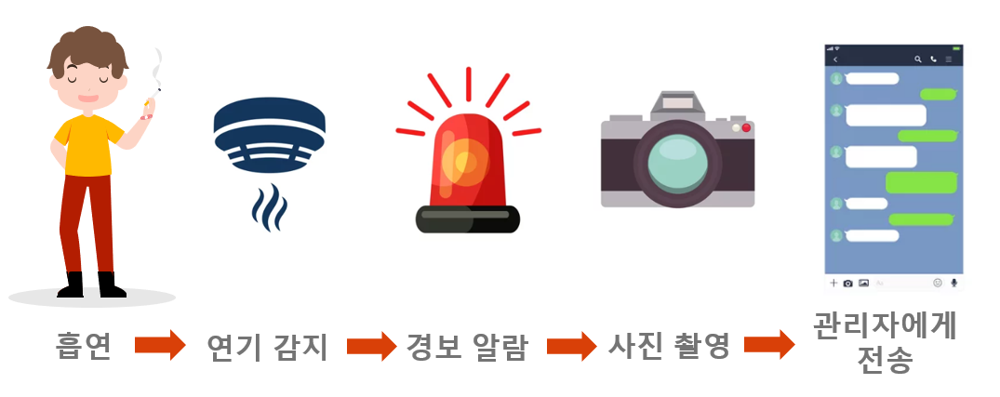  


## 02. 시스템 구성도

### 02-1 시스템 구성도
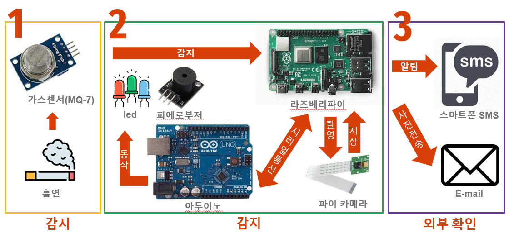  

### 02-2 시스템 회로도
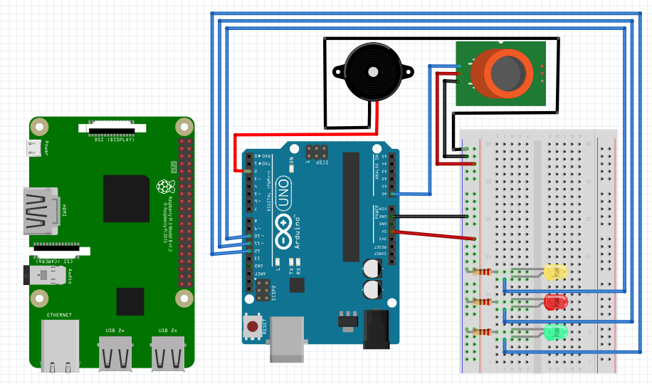  


## 03. 개발 과정

### 03-1 맡은 역할
- 김지연: MQ-7 센서, LED 제어, 카메라 제어
- 이가온: 피에로 부저, SMS 전송
- 신영진: 이메일 전송
- 박준형: 데이터베이스  

### 03-2 개발  

> ### MQ-7  가스센서
> **일산화탄소 MQ-7 가스센서 모듈**
> - MQ-7 가스센서 모듈은 일산화탄소를 공기 중에서 검출 시 사용하는 센서 모듈
> - 담배연기,  자동차 매연, 라이터 등의 일산화탄소로 구성된 가스 검출 장치에 사용
> 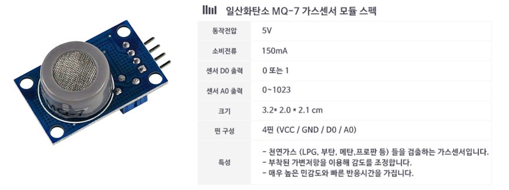  
> 
> **일산화탄소 MQ-7 가스센서 모듈 작동 기준**  
> 담배연기의 주성분인 일산화탄소 등의 농도를 측정해 감지하는 방식으로 오작동을 최소화  
> 
> **세팅 농도**  
> - 약 10% 이상 : 주변 공기의 일산화탄소 농도가 평소보다 약 10% 이상 짙어지면 흡연 인지  
> - 약 20~25% :  담배 연기가 아닌 화재로 인한 짙은 연기에만 반응하므로 화재 경보로 사용  
>   
> => **흡연 감지 시 경고음 발생, 현재 상황을 실시간으로 모니터링할 수 있어 상황에 맞게 유동적인 대처 가능**
> 
> ```python
> if seri.readable():
> 			ret = seri.readline()
> 			ret = ret[:len(ret)-1].decode()
> 			print(ret) 
> 			if ret.find(" ppm") > -1: 
> 				ret = ret.replace(' ppm', '') 
> 				ret = ret.replace(' ', '')
> 				res = ret.split(":")[1]
> 				print("res: "+ res)
> 				
> 				#아두이노에서 받아온 값을 확인 후 작업 수행(카메라 촬영, sms/email 전송)
> 				check_smoke(res)
> ```

> ### 카메라
> **흡연 및 화재 감지 시 카메라 작동**
> 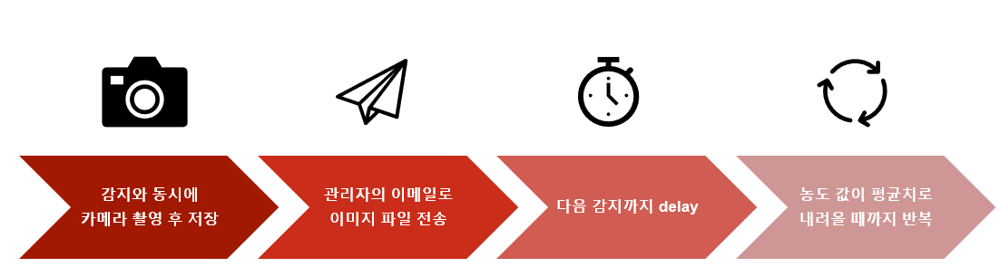  
> 
> **카메라 작동 코드**  
> ```python
> #camera
> camera = PiCamera()
> 
> camera.start_preview()
> 
> kstDate = datetime.now() + timedelta(hours=9)
> date = kstDate.strftime("%y%m%d_%H:%M") #한국 시간 
> 
> imageName = '/home/pi/Images/'+date+'.jpg'
> camera.capture(imageName)
> camera.stop_preview()
> camera.close()
> 
> ```
> **카메라 작동 조작 시 고려한 점**  
> 일산화탄소 센서 값은 1초에 한 번씩 측정되므로 흡연 및 화재 감지 시 1초마다 카메라가 작동하게 됨  
> 
> **발생한 문제**
> - 카메라 촬영이 필요 이상으로 발생, 문자메세지와 이메일이 1초에 한번씩 전송
> - 이에 따른 카메라 작동과 SMS 전송 사이 충돌 발생 우려    
> 
> **해결 방법**
> - 흡연 및 화재 감지 시 다음 센서 감지까지 delay 코드 추가
> - 흡연 감지 시: 1분 delay, 화재 감지 시: 30초 delay  


> ###  LED 제어  
> **감지된 일산화탄소 농도 값에 따라 LED 제어**  
> 
> 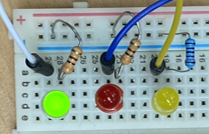
> 
> * Green LED : 주변 공기의 일산화탄소 농도가 평균치일 때

>    
> 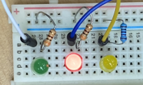
> 
> * Red LED : 주변 공기의 일산화탄소 농도가 평소보다 약 10% 이상 짙어지면 흡연으로 인지
>   
> 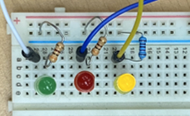
> 
> * Yellow LED : 담배 연기가 아닌 화재로 인한 짙은 연기로 인식
 
 
 
> ### 수동 부저(피에로 부저) 제어  
> 
> **감지된 일산화탄소 농도 값에 따라 수동 부저 제어**  
> 흡연을 감지했을 때와 화재를 감지했을 때 각각 다른 부저의 울림을 통해 쉽게 구분, 신속한 대처가 가능하도록 함


> ###  LED 및 부저 작동 코드  
> 
> **화재 감지**
> ```python
> if(result >= level_fire){
>     digitalWrite(yellowLed,HIGH);
>     digitalWrite(redLed,LOW);
>     digitalWrite(greenLed,LOW);
> 
>     for(int i = 300; i <= 500; i++){
>       tone(buzzer, i);
>       delay(5);
>     }
>     for(int i = 500; i >= 300; i--){
>       tone(buzzer, i);
>       delay(3);
>     }
> }
> ```
> 
> **흡연 감지**
> ```python
>  else if (result>=level_smoke && result<level_fire){
>     digitalWrite(redLed,HIGH);
>     digitalWrite(greenLed,LOW);
>     digitalWrite(yellowLed,LOW);
> 
>     for(int freq=150; freq<= 1800; freq=freq+2){
>        tone(buzzer,freq,10);
>     }
>     for(int freq=1800; freq>= 150; freq=freq-2){
>        tone(buzzer,freq,10);
>     }
> }
> ```
> 
> **아무것도 감지되지 않았을 때**
> ```python
> else if(result < level_smoke){
>     digitalWrite(greenLed,HIGH);
>     digitalWrite(redLed,LOW);
>     digitalWrite(yellowLed,LOW);
> }
> ```

> ###  SMS 전송  
> 
> **Twilio**
> - 라즈베리파이에서 관리자에게 SMS 발송을 위해 twilio 사용
> - twilio는 클라우드 상에서 SMS API, 휴대폰 인증 API, 전화서비스 등을 제공하는 사이트
>   
> 
> 
> **Twilio SMS 전송 코드**
> ```python
> #sms 전송을 위한 선언
> account_sid = 'ACae2d626835186e8a2a307620dc47af78'  #부여받은 ID
> auth_token = 'd7c5ef6178d69277dfa17762a631e6d1'     #부여받은 Token
> client = Client(account_sid, auth_token)
> ```
> ```python
> #sms 전송
> message = client.messages.create(
>     body='Smoking detected! Please check.',  #메세지 내용
>     from_='+14254752226',   #부여 받은(메시지를 보낼) 전화번호
>     to='+821083846247'      #메세지를 받을 전화번호
> )
> ```
> 
> 
> **관리자에게 메세지 전송**  
> 
> 일산화탄소 약 10% 이상  =>  흡연감지  
> 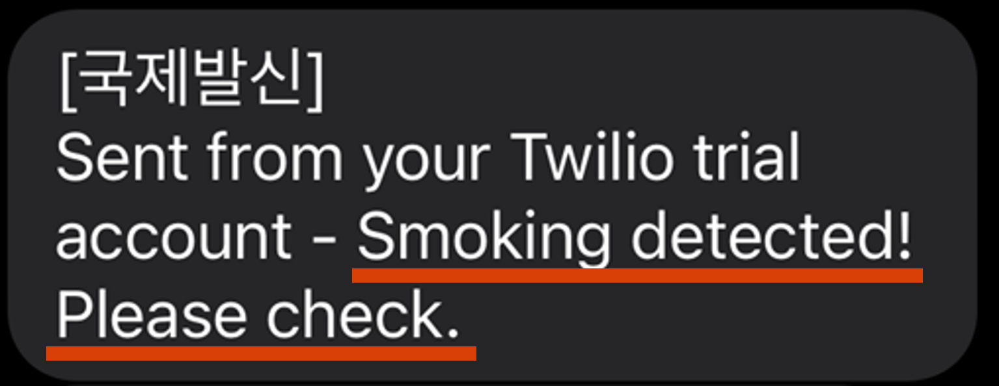  
> 
> 일산화탄소 약 20~25%  => 화재감지  
> 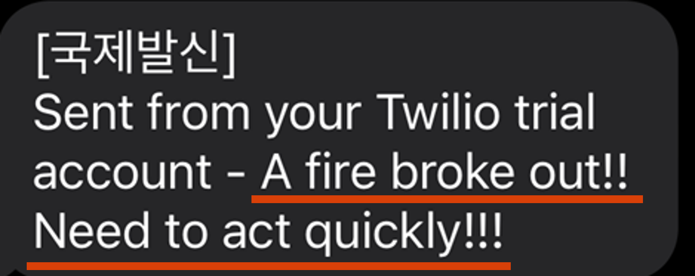


> ###  이메일 전송  
> 
> 일산화탄소 약 10% 이상  =>  흡연감지  
> 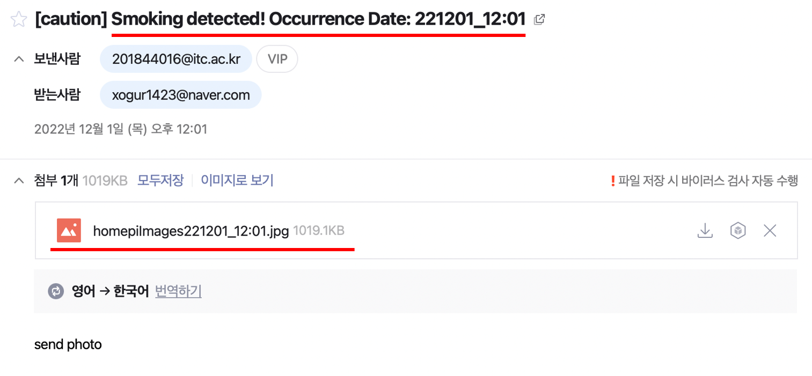
> 
> 일산화탄소 약 20~25%  => 화재감지  
> 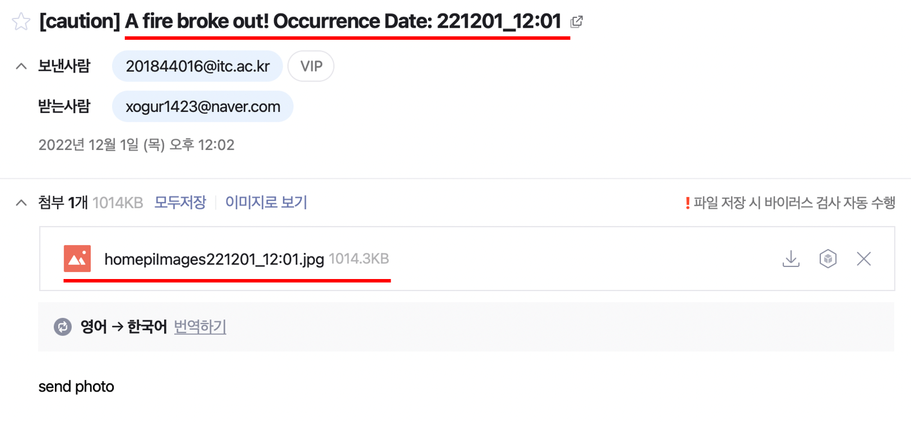
> 
> 
> 이메일로 전송된 사진  
> 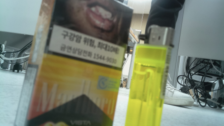
> 
> 
> **이메일 전송 코드 (흡연 감지 시)**
> ```python
> #email 전송
> smtp = smtplib.SMTP('smtp.gmail.com',587)
> smtp.starttls()
> smtp.login('201844016@itc.ac.kr', 'hnhtfvruuqdboqtq')
> 
> msg = MIMEMultipart()
> 
> msg['Subject'] = '[caution] Smoking detected! Occurrence Date: '+date
> msg['To'] = 'xogur1423@naver.com'
> text = MIMEText('send photo')
> msg.attach(text)
> > file_name=imageName
> 
> with open(file_name, 'rb')as file_FD:
>     etcPart = MIMEApplication(file_FD.read())
>     etcPart.add_header('Content-Disposition','attachment', filename=file_name)
>     msg.attach(etcPart)
>     smtp.sendmail('201844016@itc.ac.kr','xogur1423@naver.com', msg.as_string())
> 
> smtp.quit()
> ```  
> 
>   
> **이메일 전송 시 발생한 문제**  
>
>   
> > **발생한 문제 1.**  
> > - 해당 코드를 실행 하는 경우, 사용자 인증 문제가 발생  
> > 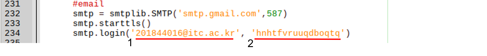  
> >  
> > **해결 방법**  
> > - 해당 구글 계정의 ‘앱 비밀번호’를 생성 후 코드 수정  
> > 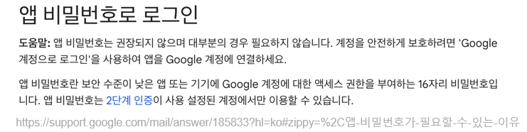  
> 
>   
> > **발생한 문제 2.**  
> > - Python 3가 설치되었음에도 불구하고 기존 Python 2.7로 실행
> > 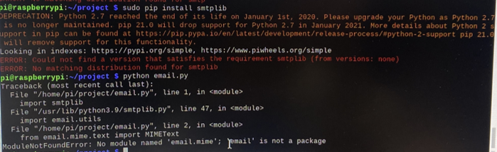  
> > 
> > **해결 방법**  
> > $sudo pip install matplotlib 실행  
> > -> 같은 오류 반복  
> > -> 다른 라즈베리파이 사용  


> ###  데이터베이스  
> **데이터베이스 저장 과정**  
>   
> 
> **MQ-7 센서에서 받아온 값을 데이터베이스에 저장하는 코드**
> ```python
> data = [{
>     'measurement' : 'pir',        
>     'tags':{
> 	'VisionUni' : '2410',
>     },
>     'fields':{
> 	"date": date,            #측정 날짜
> 	"concentration" : res    #측정 데이터 값
>     }
> }]
> client = None
> 
> try:
>     #데이터베이스 접속 코드
>     client = influxdb('localhost',8086,'root','root','pir') #connecting to influx db
>     except Exception as e:
>     print ("Exception" + str(e))
> 
> if client is not None:
>     try:
> 	 client.write_points(data) #write
>     except Exception as e:
> 	 print ("Exception write " + str(e))
>     finally:
> 	 client.close()
> #print("running influxdb OK")
> ```


## 04. 프로젝트를 마치며
### 기대효과  
1. 금연구역 관리자의 현장을 적발 도움
2. 사진 촬영으로 인한 확실한 증거 확보로 과태료 부과  
      +) 촬영은 인권침해의 논란이 있겠지만 법률에 따르면 공공의 이익과 증거 수집을 위한 사진촬영은 가능   
      +) 카메라를 설치하는 구역에 사진 촬영의 경고문을 부착한다면 해결 가능 
3. 흡연자에게 경각심을 주어 흡연율 감소
4. 비흡연자의 간접 흡연을 줄일 수 있으며 이전보다 쾌적해진 환경으로 거주민 혹은 시설 이용자들의 불편함 해소
5. 흡연 뿐만 아니라 화제까지 감지 가능

